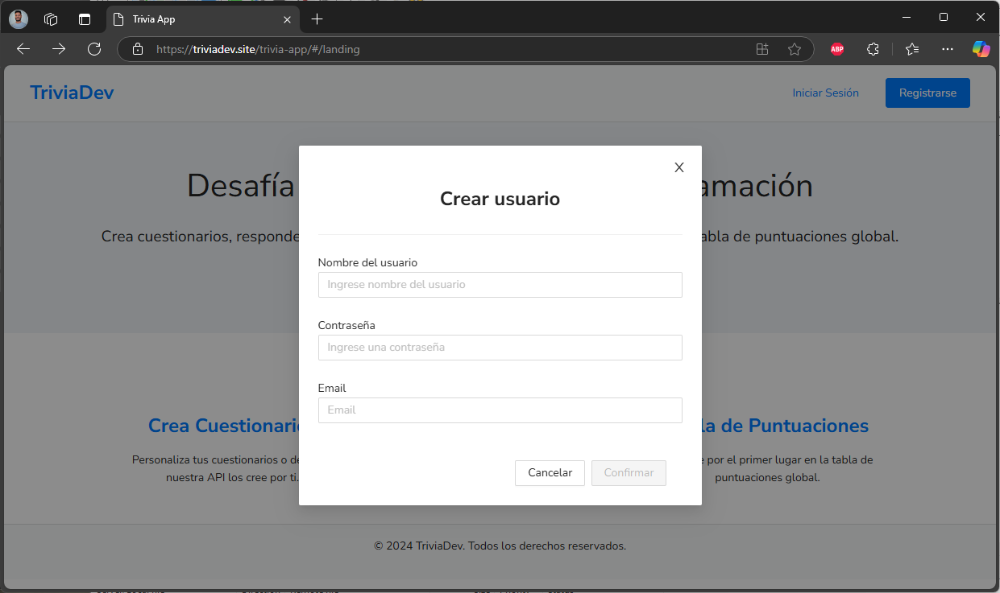

# Trivia Dev

## Información
Es una plataforma multijugador para responder preguntas sobre programacion, donde los usuarios pueden crear preguntas y cuestionarios, publicarlos, y responder también cuestionarios creados por otros usuarios. El objetivo es liderar una tabla de puntuaciones global, o de por cada categoría o nivel de dificultad.

- Link: [Trivia Dev](https://triviadev.site)

El desarrollo de la plataforma involucró tecnologías como:
- Infraestructura: Aplicación hosteada en un servidor público con motor apache y php.
- Frontend: HTML, CSS, TypeScript y JavaScript en un desarrollo en el entorno de Angular.
- Backend: Base de datos MySQL accesible através de API desarrollada en PHP puro.

### API: PreguntAPI
- Un desarrollo de [Gerard Morte](https://github.com/gerardmorte/preguntapi) realizado en node. La API provee preguntas multipleopción forrmato JSON, sobre lenguajes como C++, PHP, SQL, HTML,JavaScript entre otros.
- Link: [Preguntapi](https://alfabuenamaravilla.online)
  - [Nota: el dominio original de preguntapi está fuera de servicio, por lo que se levantó el proyecto en una instancia de AWS]

### Componentes:

 -  Modo de juego: partidas publicas multijugador.
 -  Sets de preguntas: creados manualmente o predefinidas.
 -  Puntuaciones: tablero desde las mejores puntuaciones-
 -  Niveles de dificultad: Facil, Medio y Dificil.
 -  Categorias: HTML, CSS, JavaScript, C#, C++ y Java.
   
### Como jugar

1. Registrase o iniciar sesion.
2. Crear o seleccionar un cuestionario.
3. Responde las preguntas en tu mejor tiempo.

## Página de Estadísticas
Se implementaron estadísticas con el framework [AdminLTE](https://adminlte.io/). Las mismas se tomaron a partir de la base de datos propia accesible mediante nuestra API, y se utilizaron las plantillas de controles de AdminLTE
- Link: [TriviaDev Estadísticas](https://triviadev.site/Estadisticas)

## Imágenes
### Landing Page

### Registrarse

### Login

### Dashboard

### Juego

### Puntuaciones

### Cuestionarios

### Crear Cuestionario

### Generar Preguntas

